# CameraCtrl

This repository is the official implementation of [CameraCtrl](https://arxiv.org/abs/) on top of the Stable Video Diffusion ([SVD](https://arxiv.org/abs/2311.15127)) in the image-to-video setting.

> **CameraCtrl: Enabling Camera Control for Video Diffusion Models** <br>
> [Hao He](https://hehao13.github.io), [Yinghao Xu](https://justimyhxu.github.io), [Yuwei Guo](https://guoyww.github.io), [Gordon Wetzstein](https://web.stanford.edu/~gordonwz/), [Bo Dai](http://daibo.info), [Hongsheng Li](https://www.ee.cuhk.edu.hk/~hsli/), [Ceyuan Yang](https://ceyuan.me)<br>

## [[Paper](http://arxiv.org/abs/2404.02101)] [[Project Page]( https://hehao13.github.io/projects-CameraCtrl/)] [[Weights](https://huggingface.co/hehao13/CameraCtrl_SVD_ckpts/tree/main)] [[HF Demo](https://huggingface.co/spaces/hehao13/CameraCtrl-svd-xt)]

## Todo List
- [x] Release inference code.
- [x] Release pretrained models on [AnimateDiffV3](https://github.com/guoyww/AnimateDiff).
- [x] Release training code.
- [x] Release Gradio Demo.
- [x] Release pretrained models on [SVD](https://arxiv.org/abs/2311.15127).

## News 🔥
**2024.5.24**: Release Gradio demo of CameraCtrl base on [SVD-xt](https://huggingface.co/stabilityai/stable-video-diffusion-img2vid-xt). Please refer to the [Hugginface](https://huggingface.co/spaces/hehao13/CameraCtrl-svd-xt) for detail. You can also launch the Gradio demo locally using the following script:
```bash
python demo.py
```

**2024.5.24**: Release code and pretrained CameraCtrl model [checkpoints](https://huggingface.co/hehao13/CameraCtrl_SVD_ckpts) base on [SVD](https://huggingface.co/stabilityai/stable-video-diffusion-img2vid) and [SVD-xt](https://huggingface.co/stabilityai/stable-video-diffusion-img2vid-xt). Please refer to the `svd` branch of this repository for detail.

**2024.4.3**: Release code and pratrained CameraCtrl model [checkpoint](https://huggingface.co/hehao13/CameraCtrl) based on [AnimateDiffV3](https://github.com/guoyww/AnimateDiff). Please refer to the `main` branch of this repository for detail.
## Configurations
### Environment
* 64-bit Python 3.10 and PyTorch 1.13.0 or higher.
* CUDA 11.8
* Users can use the following commands to install the packages
```bash
conda create -n cameractrl

conda activate cameractrl

pip install torch==2.2+cu118 torchvision torchaudio --index-url https://download.pytorch.org/whl/cu118

pip install -r requirements.txt
```

### Dataset
- Download the camera trajectories and videos from [RealEstate10K](https://google.github.io/realestate10k/download.html).
- Run `tools/gather_realestate.py` to get all the clips for each video.
- Run `tools/get_realestate_clips.py` to get the video clips from the original videos.
- Using [LAVIS](https://github.com/salesforce/LAVIS) or other methods to generate a caption for each video clip. We provide our extracted captions in [Google Drive](https://drive.google.com/file/d/1nytBYjTa0bJ-8AMJWVCtKT2XwkJR3Jra/view?usp=share_link) and [Google Drive](https://drive.google.com/file/d/1AGEJYbfip0jcp-ymgU9uCjUHzqETivYP/view?usp=share_link).
- Run `tools/generate_realestate_json.py` to generate the json files for training and test, you can construct the validation json file by randomly sampling some item from the training json file. 
- After the above steps, you can get the dataset folder like this
```angular2html
- RealEstate10k
  - annotations
    - test.json
    - train.json
    - validation.json
  - pose_files
    - 0000cc6d8b108390.txt
    - 00028da87cc5a4c4.txt
    - 0002b126b0a8a685.txt
    - 0003a9bce989e532.txt
    - 000465ebe46a98d2.txt
    - ...
  - video_clips
    - 00ccbtp2aSQ
    - 00rMZpGSeOI
    - 01bTY_glskw
    - 01PJ3skCZPo
    - 01uaDoluhzo
    - ...
```

## Inferences

### Prepare Models
- Download Stable Video Diffusion (SVD) from [HuggingFace](https://huggingface.co/stabilityai/stable-video-diffusion-img2vid/tree/main) or SVD-xt from [HuggingFace](https://huggingface.co/stabilityai/stable-video-diffusion-img2vid-xt/tree/main).
- Download the pretrained camera control model from [HuggingFace](https://huggingface.co/hehao13/CameraCtrl_SVD_ckpts/blob/main/CameraCtrl_svd.ckpt) (SVD) or [Huggingface](https://huggingface.co/hehao13/CameraCtrl_SVD_ckpts/blob/main/CameraCtrl_svdxt.ckpt) (SVD-xt).

### Prepare camera trajectory & prompts
- Adopt `tools/select_realestate_clips.py` to prepare trajectory txt file, some example trajectories and corresponding reference videos are in `assets/pose_files` and `assets/reference_videos`, respectively. The generated trajectories can be visualized with `tools/visualize_trajectory.py`.
- Prepare the condition images, we provide some condition images in `assets/example_condition_images`, all these images are generated using the [SDXL](http://arxiv.org/abs/2307.01952) model using the python script `inference_sdxl.py`. Some of the captions to generate those images are `assets/sdxl_captions.txt`.
- Prepare the prompt file including the path to condition images, one example is `assets/svd_prompts.json`.

### Inference
- Run `inference.py` to sample videos
```shell
python -m torch.distributed.launch --nproc_per_node=8 --master_port=25000 inference.py \
      --out_root ${OUTPUT_PATH} \
      --num_frames ${14 for SVD, 25 for SVD-xt}
      --ori_model_path ${SVD_PATH or SVD-xt_PATH} \
      --pose_adaptor_ckpt ${CAMERACTRL_CKPT} \
      --prompt_file assets/svd_prompts.json \
      --trajectory_file assets/pose_files/0c9b371cc6225682_svd.txt \
      --model_config configs/train_cameractrl/svd_320_576_cameractrl.yaml \
      --n_procs 8
```

where

- `OUTPUT_PATH` refers to the path to save resules.
- `SVD_PATH` refers to the root path of the downloaded SVD model.
- `SVD-xt_PATH` refers to the root path of the downloaded SVD-xt model.
- `CAMERACTRL_CKPT` refers to the downloaded CameraCtrl model path.

The above inference example is used to generate videos in the original T2V model domain. The `inference.py` script supports 
generate videos in other domains with image LoRAs (`args.image_lora_rank` and `args.image_lora_ckpt`), like the [RealEstate10K](https://huggingface.co/hehao13/CameraCtrl/blob/main/RealEstate10K_LoRA.ckpt) LoRA or some personalized base models (`args.personalized_base_model`), like the [Realistic Vision](https://civitai.com/models/4201?modelVersionId=130072). please refer to the code for detail.

### Results
<table>
  <tr>
    <th width=33.4% style="text-align:center">Condition Images</th>
    <th width=33.3% style="text-align:center">Reference Videos</th>
    <th width=33.3% style="text-align:center">Generated Videos</th>
  </tr>
  <tr>
    <td width=33.4% style="text-align:center">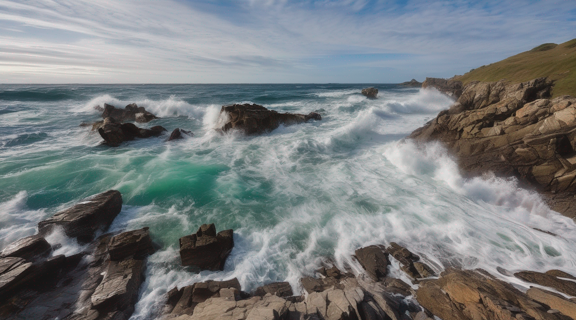</td>
    <td width=33.3% style="text-align:center">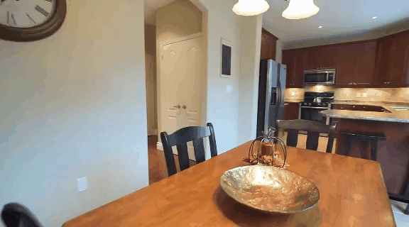</td>
    <td width=33.3% style="text-align:center">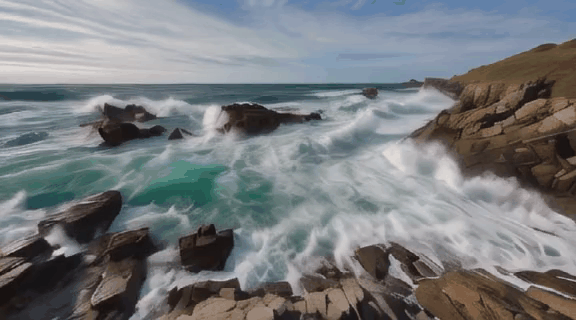</td>
  </tr>
  <tr>
    <td width=33.4% style="text-align:center"></td>
    <td width=33.3% style="text-align:center">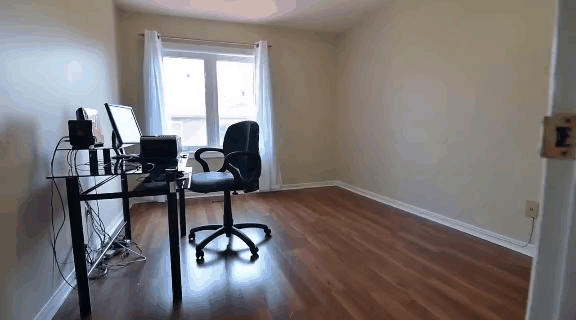</td>
    <td width=33.3% style="text-align:center">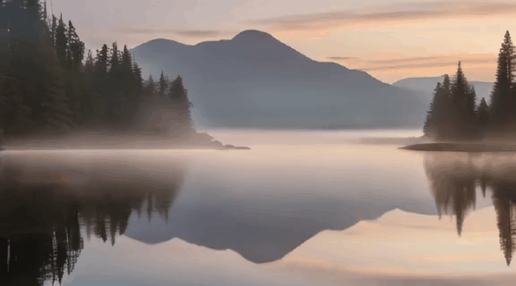</td>
  </tr>
  <tr>
    <td width=33.4% style="text-align:center">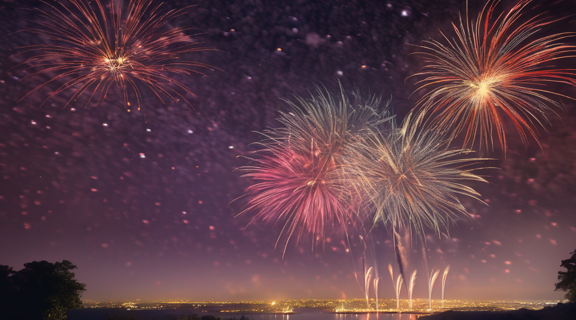</td>
    <td width=33.3% style="text-align:center">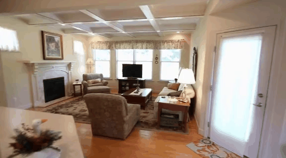</td>
    <td width=33.3% style="text-align:center"></td>
  </tr>
  <tr>
    <td width=33.4% style="text-align:center"></td>
    <td width=33.3% style="text-align:center">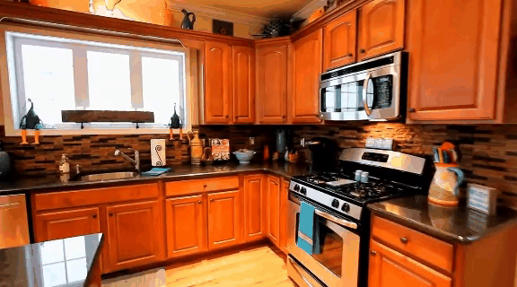</td>
    <td width=33.3% style="text-align:center">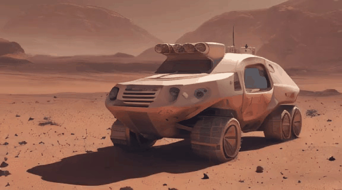</td>
  </tr>
  <tr>
    <td width=33.4% style="text-align:center">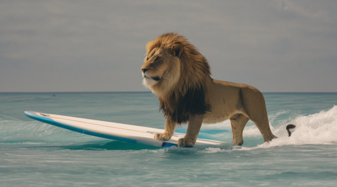</td>
    <td width=33.3% style="text-align:center"></td>
    <td width=33.3% style="text-align:center">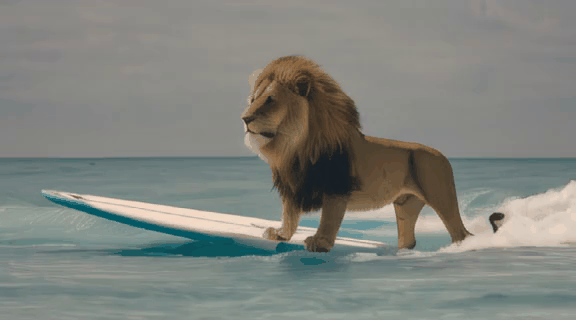</td>
  </tr>
  <tr>
    <td width=33.4% style="text-align:center">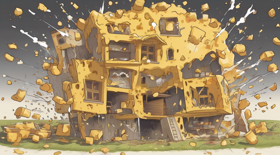</td>
    <td width=33.3% style="text-align:center">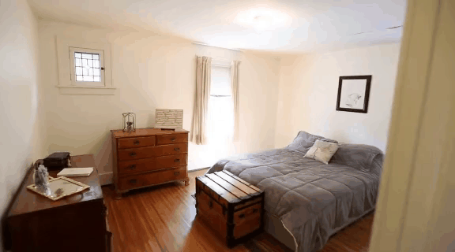</td>
    <td width=33.3% style="text-align:center">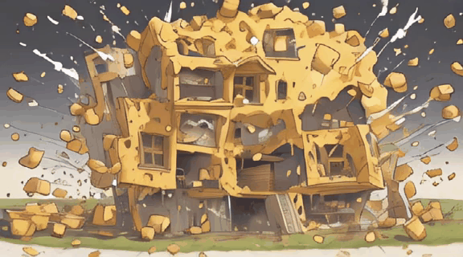</td>
  </tr>
</table>

## Training
Update the below paths to data and pretrained model of the config `configs/train_cameractrl/svd_320_576_cameractrl.yaml`
```shell
pretrained_model_path: "[replace with SVD root path]"
train_data:
  root_path:       "[replace RealEstate10K root path]"
validation_data:
  root_path:       "[replace RealEstate10K root path]"
```
Other training parameters (lr, epochs, validation settings, etc.) are also included in the config files.


Then, launch the camera control model training using slurm 
```shell
./slurm_run.sh ${PARTITION} cameractrl 8 configs/train_cameractrl/svd_320_576_cameractrl.yaml train_camera_control.py
```
or PyTorch
```shell
./dist_run.sh configs/train_cameractrl/svd_320_576_cameractrl.yaml 8 train_camera_control.py
```

## Acknowledgement
We thank [AnimateDiff](https://github.com/guoyww/AnimateDiff) and [animate-anything](https://github.com/alibaba/animate-anything)  for their amazing codes and models.

## BibTeX

```bibtex
@misc{he2024cameractrl,
      title={CameraCtrl: Enabling Camera Control for Text-to-Video Generation}, 
      author={Hao He and Yinghao Xu and Yuwei Guo and Gordon Wetzstein and Bo Dai and Hongsheng Li and Ceyuan Yang},
      year={2024},
      eprint={2404.02101},
      archivePrefix={arXiv},
      primaryClass={cs.CV}
}
```