# CameraCtrl

This repository is the official implementation of [CameraCtrl](http://arxiv.org/abs/2404.02101).

This `main` branch contains the codes and model for CameraCtrl implemented on AnimateDiffV3. For codes and models of CameraCtrl with stable video diffusion, please refer to the `svd` branch for detail. 

> **CameraCtrl: Enabling Camera Control for Video Diffusion Models** <br>
> [Hao He](https://hehao13.github.io), [Yinghao Xu](https://justimyhxu.github.io), [Yuwei Guo](https://guoyww.github.io), [Gordon Wetzstein](https://web.stanford.edu/~gordonwz/), [Bo Dai](http://daibo.info), [Hongsheng Li](https://www.ee.cuhk.edu.hk/~hsli/), [Ceyuan Yang](https://ceyuan.me)<br>

## [[Paper](http://arxiv.org/abs/2404.02101)] [[Project Page]( https://hehao13.github.io/projects-CameraCtrl/)] [[Weights](https://huggingface.co/hehao13/CameraCtrl/tree/main)] [[HF Demo](https://huggingface.co/spaces/hehao13/CameraCtrl-svd-xt)]

## Todo List
- [x] Release inference code.
- [x] Release pretrained models on [AnimateDiffV3](https://github.com/guoyww/AnimateDiff).
- [x] Release training code.
- [x] Release Gradio Demo.
- [x] Release pretrained models on SVD in the `svd` branch.

## Configurations
### Environment
* 64-bit Python 3.10 and PyTorch 1.13.0 or higher.
* CUDA 11.7 
* Users can use the following commands to install the packages
```bash
conda env create -f environment.yaml
conda activate cameractrl
```

### Dataset
- Download the camera trajectories and videos from [RealEstate10K](https://google.github.io/realestate10k/download.html).
- Run `tools/gather_realestate.py` to get all the clips for each video.
- Run `tools/get_realestate_clips.py` to get the video clips from the original videos.
- Using [LAVIS](https://github.com/salesforce/LAVIS) or other methods to generate a caption for each video clip. We provide our extracted captions in [Google Drive](https://drive.google.com/file/d/1nytBYjTa0bJ-8AMJWVCtKT2XwkJR3Jra/view?usp=share_link) and [Google Drive](https://drive.google.com/file/d/1AGEJYbfip0jcp-ymgU9uCjUHzqETivYP/view?usp=share_link).
- Run `tools/generate_realestate_json.py` to generate the json files for training and test, you can construct the validation json file by randomly sampling some item from the training json file. 
- After the above steps, you can get the dataset folder like this
```angular2html
- RealEstate10k
  - annotations
    - test.json
    - train.json
    - validation.json
  - pose_files
    - 0000cc6d8b108390.txt
    - 00028da87cc5a4c4.txt
    - 0002b126b0a8a685.txt
    - 0003a9bce989e532.txt
    - 000465ebe46a98d2.txt
    - ...
  - video_clips
    - 00ccbtp2aSQ
    - 00rMZpGSeOI
    - 01bTY_glskw
    - 01PJ3skCZPo
    - 01uaDoluhzo
    - ...
```

## Inferences

### Prepare Models
- Download Stable Diffusion V1.5 (SD1.5) from [HuggingFace](https://huggingface.co/runwayml/stable-diffusion-v1-5/tree/main).
- Download the checkpoints of AnimateDiffV3 (ADV3) adaptor and motion module from [AnimateDiff](https://github.com/guoyww/AnimateDiff).
- Download the pretrained camera control model from [HuggingFace](https://huggingface.co/hehao13/CameraCtrl/blob/main/CameraCtrl.ckpt).
- Run `tools/merge_lora2unet.py` to merge the ADV3 adaptor weights into SD1.5 unet and save results to new subfolder (like, `unet_webvidlora_v3`) under the SD1.5 folder.
- (Optional) Download the pretrained image LoRA model on RealEstate10K dataset from [HuggingFace](https://huggingface.co/hehao13/CameraCtrl/blob/main/RealEstate10K_LoRA.ckpt) to sample videos on indoor and outdoor estates.
- (Optional) Download the personalized base model, like [Realistic Vision](https://civitai.com/models/4201?modelVersionId=130072) from [CivitAI](https://civitai.com).

### Prepare camera trajectory & prompts
- Adopt `tools/select_realestate_clips.py` to prepare trajectory txt file, some example trajectories and corresponding reference videos are in `assets/pose_files` and `assets/reference_videos`, respectively. The generated trajectories can be visualized with `tools/visualize_trajectory.py`.
- Prepare the prompts (negative prompts, specific seeds), one example is `assets/cameractrl_prompts.json`. 

### Inference
- Run `inference.py` to sample videos
```shell
python -m torch.distributed.launch --nproc_per_node=8 --master_port=25000 inference.py \
      --out_root ${OUTPUT_PATH} \
      --ori_model_path ${SD1.5_PATH} \ 
      --unet_subfolder ${SUBFOUDER_NAME} \
      --motion_module_ckpt ${ADV3_MM_CKPT} \ 
      --pose_adaptor_ckpt ${CAMERACTRL_CKPT} \
      --model_config configs/train_cameractrl/adv3_256_384_cameractrl_relora.yaml \
      --visualization_captions assets/cameractrl_prompts.json \
      --use_specific_seeds \
      --trajectory_file assets/pose_files/0f47577ab3441480.txt \
      --n_procs 8
```

where

- `OUTPUT_PATH` refers to the path to save resules.
- `SD1.5_PATH` refers to the root path of the downloaded SD1.5 model.
- `SUBFOUDER_NAME` refers to the subfolder name of unet in the `SD1.5_PATH`, default is `unet`. Here we adopt the name specified by `tools/merge_lora2unet.py`.
- `ADV3_MM_CKPT` refers to the path of the downloaded AnimateDiffV3 motion module checkpoint.
- `CAMERACTRL_CKPT` refers to the 

The above inference example is used to generate videos in the original T2V model domain. The `inference.py` script supports 
generate videos in other domains with image LoRAs (`args.image_lora_rank` and `args.image_lora_ckpt`), like the [RealEstate10K](https://huggingface.co/hehao13/CameraCtrl/blob/main/RealEstate10K_LoRA.ckpt) LoRA or some personalized base models (`args.personalized_base_model`), like the [Realistic Vision](https://civitai.com/models/4201?modelVersionId=130072). please refer to the code for detail.

### Results
- Same text prompt with different camera trajectories
<table>
  <tr>
    <th width=13.3% style="text-align:center">Camera Trajectory</th>
    <th width=20% style="text-align:center">Video</th>
    <th width=13.3% style="text-align:center">Camera Trajectory</th>
    <th width=20% style="text-align:center">Video</th>
    <th width=13.3% style="text-align:center">Camera Trajectory</th>
    <th width=20% style="text-align:center">Video</th>
  </tr>
  <tr>
    <td width=13.3% >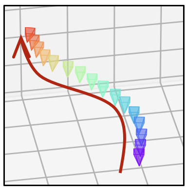</td>
    <td width=20%>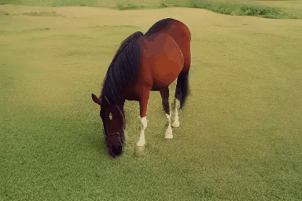</td>
    <td width=13.3%>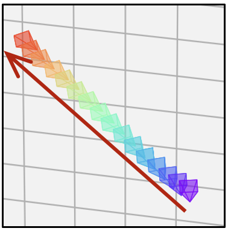</td>
    <td width=20%>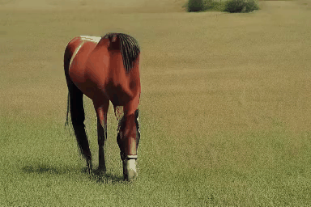</td>
    <td width=13.3%>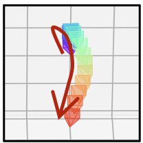</td>
    <td width=20%>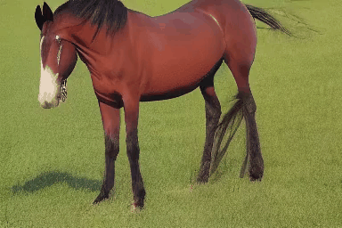</td>
  </tr>
  <tr>
    <td width=13.3%>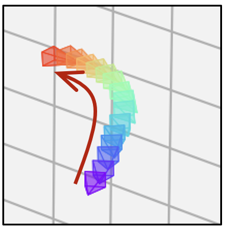</td>
    <td width=20%>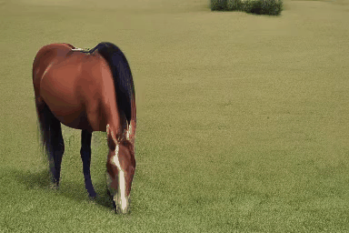</td>
    <td width=13.3%>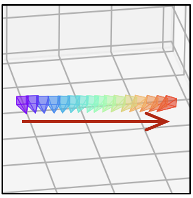</td>
    <td width=20%>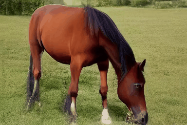</td>
    <td width=13.3%>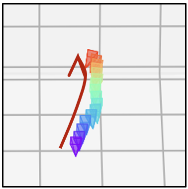</td>
    <td width=20%>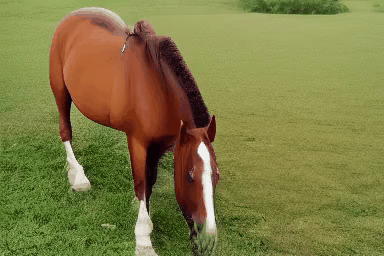</td>
  </tr>
</table>

- Camera control on different domains' videos
<table>
  <tr>
    <th width=11.7% style="text-align:center">Generator</th>
    <th width=11.7% style="text-align:center">Camera Trajectory</th>
    <th width=17.6% style="text-align:center">Video</th>
    <th width=11.7% style="text-align:center">Camera Trajectory</th>
    <th width=17.6% style="text-align:center">Video</th>
    <th width=11.7% style="text-align:center">Camera Trajectory</th>
    <th width=17.6% style="text-align:center">Video</th>
  </tr>
  <tr>
    <td width=11.7% style="text-align:center" width="90%">SD1.5</td>
    <td width=11.7%>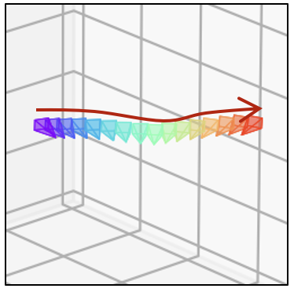</td>
    <td width=17.6%></td>
    <td width=11.7%>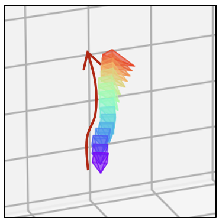</td>
    <td width=17.6%>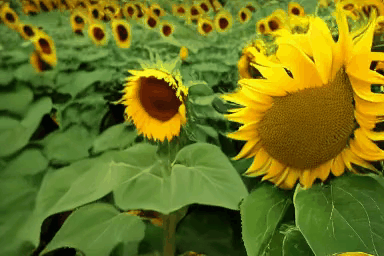</td>
    <td width=11.7%>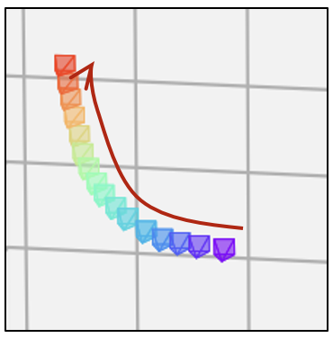</td>
    <td width=17.6%></td>
  </tr>
  <tr>
    <td width=11.7% style="text-align:center"  width="90%">SD1.5 +  RealEstate LoRA </td>
    <td width=11.7%>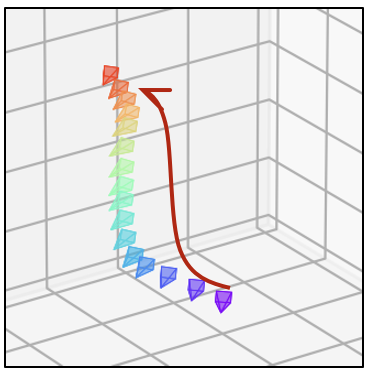</td>
    <td width=17.6%>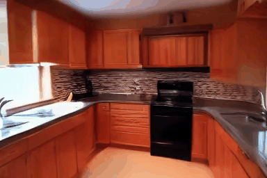</td>
    <td width=11.7%></td>
    <td width=17.6%>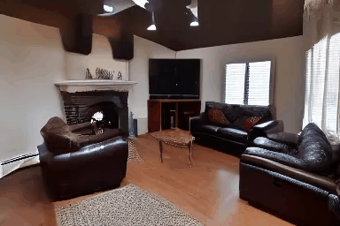</td>
    <td width=11.7%>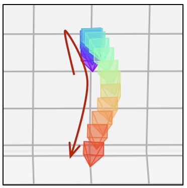</td>
    <td width=17.6%>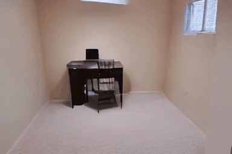</td>
  </tr>
  <tr>
    <td width=11.7% style="text-align:center" width="90%">Realistic Vision</td>
    <td width=11.7%>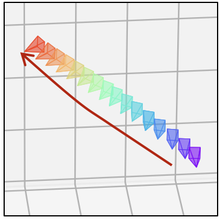</td>
    <td width=17.6%></td>
    <td width=11.7%>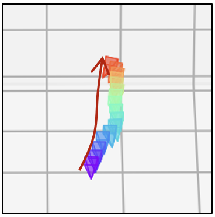</td>
    <td width=17.6%></td>
    <td width=11.7%>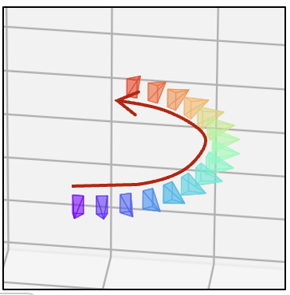</td>
    <td width=17.6%>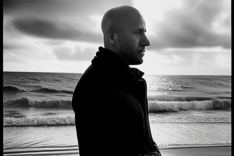</td>
  </tr>
  <tr>
    <td width=11.7% style="text-align:center" width="90%">ToonYou</td>
    <td width=11.7%>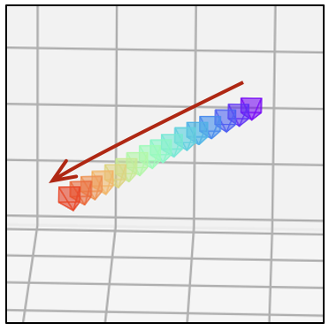</td>
    <td width=17.6%></td>
    <td width=11.7%>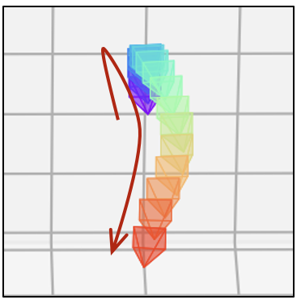</td>
    <td width=17.6%></td>
    <td width=11.7%>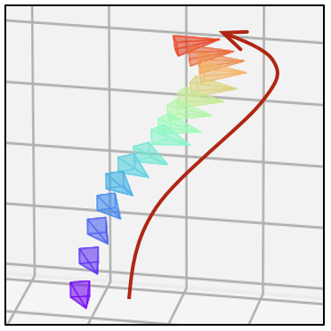</td>
    <td width=17.6%></td>
  </tr>
</table>

Note that, each image paired with the video represents the camera trajectory. Each small tetrahedron on the image represents the position and orientation of the camera for one video frame. Its vertex stands for the camera location, while the base represents the imaging plane of the camera. The red arrows indicate the movement of camera **position**. The camera rotation can be observed through the orientation of the tetrahedrons.


## Training

### Step1 (RealEstate10K image LoRA)
Update the below paths to data and pretrained model of the config `configs/train_image_lora/realestate_lora.yaml`
```shell
pretrained_model_path: "[replace with SD1.5 root path]"
train_data:
  root_path: "[replace RealEstate10K root path]"
```
Other training parameters (lr, epochs, validation settings, etc.) are also included in the config files.

Then, launch the image LoRA training using slurm 
```shell
./slurm_run.sh ${PARTITION} image_lora 8 configs/train_image_lora/realestate_lora.yaml train_image_lora.py
```
or PyTorch
```shell
./dist_run.sh configs/train_image_lora/realestate_lora.yaml 8 train_image_lora.py
```
We provide our pretrained checkpoint of the RealEstate10K LoRA model in [HuggingFace](https://huggingface.co/hehao13/CameraCtrl/blob/main/RealEstate10K_LoRA.ckpt).

### Step2 (Camera control model)
Update the below paths to data and pretrained model of the config `configs/train_cameractrl/adv3_256_384_cameractrl_relora.yaml`
```shell
pretrained_model_path: "[replace with SD1.5 root path]"
train_data:
  root_path: "[replace RealEstate10K root path]"
validation_data:
  root_path:       "[replace RealEstate10K root path]"
lora_ckpt: "[Replace with RealEstate10k image LoRA ckpt]"
motion_module_ckpt: "[Replace with ADV3 motion module]"
```
Other training parameters (lr, epochs, validation settings, etc.) are also included in the config files.


Then, launch the camera control model training using slurm 
```shell
./slurm_run.sh ${PARTITION} cameractrl 8 configs/train_cameractrl/adv3_256_384_cameractrl_relora.yaml train_camera_control.py
```
or PyTorch
```shell
./dist_run.sh configs/train_cameractrl/adv3_256_384_cameractrl_relora.yaml 8 train_camera_control.py
```

## Disclaimer
This project is released for academic use. We disclaim responsibility for user-generated content. Users are solely liable for their actions. The project contributors are not legally affiliated with, nor accountable for, users' behaviors. Use the generative model responsibly, adhering to ethical and legal standards. 


## Acknowledgement
We thank [AnimateDiff](https://github.com/guoyww/AnimateDiff) for their amazing codes and models.


## BibTeX

```bibtex
@article{he2024cameractrl,
      title={CameraCtrl: Enabling Camera Control for Text-to-Video Generation}, 
      author={Hao He and Yinghao Xu and Yuwei Guo and Gordon Wetzstein and Bo Dai and Hongsheng Li and Ceyuan Yang},
      journal={arXiv preprint arXiv:2404.02101},
      year={2024}
}
```
